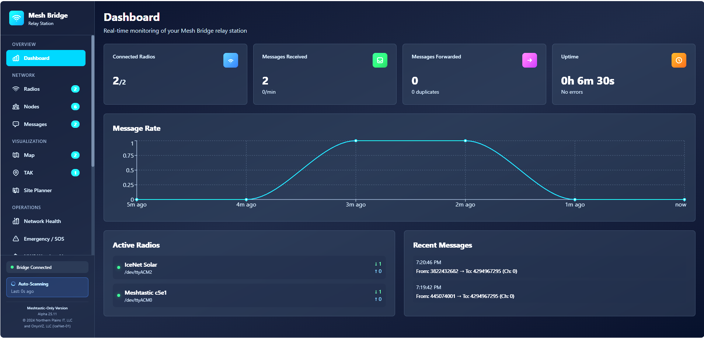

# Mesh Bridge - Meshtastic Relay Station

A powerful **web-based communication gateway** for Meshtastic radios. Features message bridging (2+ radios), AI assistant, email/Discord notifications, interactive commands, and real-time monitoring. Built with React, TypeScript, and Node.js with official Meshtastic libraries.

**Meshtastic-Only Version** - Focused exclusively on Meshtastic protocol support for optimal performance and reliability.

**Works great with just ONE radio!** While designed for bridging multiple radios, the AI assistant, email/Discord notifications, and command system make it incredibly useful even with a single device.

-blue.svg)


## Screenshots

> **Note:** Add your own screenshots to showcase the application! Suggested screenshots to include:

### Dashboard

*Real-time monitoring of connected radios, message traffic, and system statistics*

### Message Monitor

*Live feed of all mesh messages with timestamps and signal quality*

### Network Health

*Channel utilization, signal quality analysis, and network insights*

### Emergency Response & Weather Alerts

*SOS tracking, auto-response, and severe weather monitoring from NWS*

### Interactive Map

*Visualize node locations and mesh network topology*

### AI Assistant Configuration

*Configure local AI models with Ollama integration*

### TAK Tactical View

*Team Awareness Kit style tactical display with breadcrumb trails*

---

## Version Alpha 25.11.2 🚀

**NEW Architecture:**
- 🌐 **Web-Based GUI** - accessible from any modern browser
- ⚡ **Node.js Bridge Server** - using official @meshtastic/core library
- 🔌 **WebSocket Communication** - real-time updates between frontend and bridge
- 📱 **PWA Support** - installable as a progressive web app
- 🔄 **Auto Message Forwarding** - intelligent channel-aware bridging
- ✨ **Smart Channel Matching** - handles different channel configurations across radios
- 🛠️ **System Service Support** - runs as permanent service with auto-start on boot
- 💾 **Persistent Configuration** - all settings saved automatically across restarts

## Features

🎯 **Core Functionality**
- 📡 Support for **1+ Meshtastic radios** (single radio gets AI, commands, notifications!)
- 🔄 **Automatic bidirectional message forwarding** (2+ radios only, no manual route configuration needed)
- 🔐 **Smart channel matching** - forwards messages based on PSK+name, not just index
- 🛡️ Message deduplication and loop prevention
- 🔌 Auto-detect USB-connected devices
- ⚡ Real-time message forwarding and monitoring
- 🔄 **Robust reconnection** - automatic cleanup and self-healing after radio reboots
- 💾 **Stable radio IDs** - same radio always gets same ID on reconnect (no duplicates!)

⚙️ **Radio Configuration**
- 📻 **Channel configuration via serial** - get/set channel settings for all 8 channels
- 🔐 **Complete channel control** - name, PSK, role, uplink/downlink settings
- 📡 **LoRa config display** - view radio parameters directly in UI
- 🔁 **Bulk operations** - get all channels at once
- 💾 **Persistent settings** - all configurations saved automatically

📊 **Monitoring & Analytics**
- Real-time dashboard with live statistics
- Message traffic monitoring
- Per-radio message counters (received, forwarded)
- Connection status indicators
- Message history with filtering
- 📊 **Memory management** - automatic log rotation and cleanup
- 🔋 **Long-running optimized** - perfect for 24/7 deployments

⚙️ **Advanced Channel Handling**
- **Cross-index forwarding** - handles radios with channels on different indices
- **Private channel support** - forwards encrypted channels if configured on both bridge radios
- **Multi-mesh bridging** - can bridge between different encrypted meshes
- **Automatic PSK matching** - finds matching channels by encryption key and name

🤖 **Interactive Command System**
- **Bridge commands** - send commands like `#weather Seattle` or `#ping` from your radio
- **16 built-in commands** - weather, status, uptime, radios, channels, stats, ai, email, discord, and more
- **Rate limiting** - prevents command spam (max 10/min per user)
- **No phone needed** - get info directly on radio screen
- **Fully configurable** - enable/disable commands, change prefix, customize

🧠 **AI Assistant**
- **Local AI queries** - ask questions via `#ai [question]` or `#ask [question]` from your radio
- **Powered by Ollama** - runs locally on your hardware (Raspberry Pi 4+ supported)
- **Mesh-optimized** - responses automatically shortened to fit Meshtastic message limits (~200 chars)
- **Multiple models** - choose from ultra-fast 1B models to more capable 3B models
- **Model management UI** - install, switch, and configure models directly from web interface
- **Rate limited** - max 3 AI queries per minute per user to conserve resources
- **No cloud required** - completely local, private, and works offline

📧 **Communication Notifications**
- **Email notifications** - send emails from your radio via `#email [message]`
- **Discord webhook (one-way)** - post to Discord channels via `#discord [message]`
- **Discord bot (two-way)** - receive Discord messages and forward to mesh!
- **Multi-channel notify** - send to both with `#notify [message]`
- **SMTP support** - works with Gmail, Outlook, custom mail servers
- **Web UI configuration** - configure and test from the interface
- **Perfect for alerts** - notify yourself from remote locations
- 💾 **Persistent settings** - all notification configs saved automatically

🤖 **Discord Integration**
- **Webhook Mode (One-Way)**:
  - Send mesh messages TO Discord using `#discord` command
  - Simple setup with webhook URL
  - Perfect for notifications

- **Bot Mode (Two-Way)**:
  - Receive Discord messages and forward TO mesh
  - Send mesh messages TO Discord channel
  - Full bidirectional communication
  - Reacts with ✅/❌ to show send status

- Both can run simultaneously!

🔧 **MQTT Integration**
- **MQTT bridge** - publish mesh messages to MQTT broker
- **Bidirectional** - receive MQTT messages and forward to mesh
- **Topic configuration** - customizable topic prefix
- **QoS support** - quality of service levels
- **Retain messages** - optional message retention
- 💾 **Persistent settings** - MQTT config saved automatically

🚨 **Emergency Response System**
- **SOS emergency tracking** - auto-detects emergency keywords (#sos, #emergency, #help, #911, mayday, etc.)
- **Auto-response** - automatically sends help instructions and requests GPS location
- **Status tracking** - manage emergencies through active, responding, and resolved states
- **Critical info display** - shows GPS coordinates, battery level, signal strength (SNR)
- **Emergency broadcasting** - broadcast emergencies to all nodes on the mesh
- **Google Maps integration** - view emergency locations directly in maps
- **NWS weather alerts** - fetch and auto-broadcast severe weather warnings from National Weather Service
- **Weather monitoring** - monitor by state or GPS coordinates with configurable intervals
- **Severity-based alerts** - color-coded alerts (Extreme, Severe, Moderate, Minor)
- **Audio alerts** - plays sound when new emergencies or severe weather detected
- **Safety protocols** - built-in emergency response documentation and procedures

🎨 **Modern UI**
- Clean, dark-themed interface
- Responsive design with Tailwind CSS
- Real-time updates via WebSocket
- Intuitive navigation
- Mobile-friendly PWA

💾 **System Reliability**
- **Memory management** - automatic log rotation (5000 console lines, 1000 messages)
- **Age-based cleanup** - removes old dedup cache (1 hour retention)
- **Memory stats reporting** - shows usage every 10 minutes
- **Stable reconnection** - port-based radio IDs prevent duplicates
- **Self-healing** - automatic cleanup of disconnected radios
- **Perfect for 24/7** - optimized for long-running deployments

---

## 🚀 Quick Start

### Prerequisites

- **Node.js 18+** (required for bridge server)
- **Modern Browser**: Chrome, Firefox, Edge, Safari
- **Meshtastic Device(s)**: 1+ radio connected via USB (2+ for message bridging)
- **Git**: For cloning the repository
- **Ollama** (optional): For AI assistant features
- **SMTP Account** (optional): For email notifications
- **Discord Webhook/Bot** (optional): For Discord integration

### Installation (Development Mode)

```bash
# Clone the repository
git clone https://github.com/IceNet-01/Mesh-Bridge.git
cd Mesh-Bridge

# Install dependencies
npm install

# Start the application (both bridge server and web UI)
npm run start
```

**Development mode** starts two servers:
- **Bridge Server**: http://localhost:8080 (WebSocket)
- **Web UI (Vite)**: http://localhost:5173 (with hot-reload)

Open your browser to **http://localhost:5173**

### Run as System Service (Linux) - RECOMMENDED FOR PRODUCTION

Install as a permanent service that starts on boot:

```bash
# Run the production installation script
bash scripts/install.sh
```

The installation script will:
- ✅ Install dependencies
- ✅ Configure port (default: 8888, less commonly used to avoid conflicts)
- ✅ Build production frontend
- ✅ Create systemd service file
- ✅ Enable auto-start on boot
- ✅ Start the service immediately
- ✅ Display service status and access URL

**Access the Interface:**
- **Locally**: http://localhost:8888 (or your configured port)
- **On LAN**: http://YOUR_LOCAL_IP:8888 (shown during startup)
- **Example**: http://192.168.1.100:8888

The server automatically binds to `0.0.0.0`, making it accessible from any device on your local network!

**Service Management:**
```bash
sudo systemctl start mesh-bridge      # Start service
sudo systemctl stop mesh-bridge       # Stop service
sudo systemctl restart mesh-bridge    # Restart service
sudo systemctl status mesh-bridge     # Check status
sudo journalctl -u mesh-bridge -f     # View live logs
```

**Reconfigure Port:**
```bash
bash scripts/configure-port.sh        # Change port and restart
```

**Uninstall Service:**
```bash
bash scripts/uninstall.sh
```

Benefits:
- ✅ Starts automatically on system boot
- ✅ Auto-restarts if it crashes (10 second delay)
- ✅ Radio connections persist even when browser is closed
- ✅ Intelligent port conflict handling (automatically finds available port)
- ✅ Default port 8888 avoids conflicts with common dev servers
- ✅ Accessible on LAN for remote access
- ✅ Security hardening (NoNewPrivileges, PrivateTmp)
- ✅ All settings persist across restarts
- ✅ Production-optimized build

### Production Build (Manual)

```bash
# Build the frontend
npm run build

# Run in production mode (serves both on port 8080)
npm run production
```

---

## Network Access

### LAN/Remote Access

**The bridge server automatically binds to `0.0.0.0`**, making it accessible from any device on your local network!

**Access from other devices:**
1. Find your server's local IP address (shown on bridge startup)
2. Open browser on any device on the same network
3. Navigate to `http://YOUR_SERVER_IP:8080`
4. Full functionality works remotely!

**Example:**
```
Bridge Server running on: 192.168.1.100
Access from phone:        http://192.168.1.100:8080
Access from tablet:       http://192.168.1.100:8080
Access from laptop:       http://192.168.1.100:8080
Access locally:           http://localhost:8080
```

**Security Considerations:**
- The server is accessible to anyone on your LAN
- For internet access, use a reverse proxy (nginx, Caddy) with authentication
- Consider firewall rules if exposing to WAN
- HTTPS recommended for remote access (use reverse proxy)

**Finding Your IP Address:**
```bash
# Linux/macOS
hostname -I | awk '{print $1}'

# Or look for it in the bridge startup logs
npm run bridge
# Shows: 🌐 Access on LAN: http://192.168.1.100:8080 (eth0)
```

---

## Configuration

### Discord Bot Setup (Two-Way)

For bidirectional Discord ↔ Mesh communication:

1. **Create Discord Bot**:
   - Go to https://discord.com/developers/applications
   - Create new application → Add Bot
   - Enable **MESSAGE CONTENT INTENT** (required!)
   - Copy bot token

2. **Invite Bot to Server**:
   - OAuth2 → URL Generator
   - Select: `bot` scope
   - Permissions: Send Messages, Read Message History, Add Reactions
   - Use generated URL to invite

3. **Get Channel ID**:
   - Enable Developer Mode in Discord
   - Right-click channel → Copy ID

4. **Configure in UI**:
   - Go to Communication Settings
   - Enable Discord Bot
   - Enter bot token and channel ID
   - Save settings

5. **Restart bridge** - bot will connect automatically!

### Discord Webhook Setup (One-Way)

For simple notifications from mesh TO Discord:

1. In Discord: Server Settings → Integrations → Webhooks
2. Create webhook, copy URL
3. In bridge UI: Communication Settings → Discord Webhook
4. Paste webhook URL, save
5. Use `#discord [message]` from radio!

### Email Setup

1. Get SMTP credentials (Gmail app password recommended)
2. In UI: Communication Settings → Email
3. Enter SMTP host, port, username, password
4. Test connection
5. Use `#email [message]` from radio!

### MQTT Setup

1. Have MQTT broker URL ready
2. In UI: MQTT Settings
3. Enter broker URL, credentials, topic prefix
4. Test connection
5. Messages automatically bridge!

---

## How It Works

### Architecture

**Development Mode** (two servers):
```
┌─────────────────┐
│   Web Browser   │ ← You interact here
│  (localhost:5173)│    (Vite dev server with hot-reload)
└────────┬────────┘
         │ WebSocket
         │
┌────────▼────────┐
│  Bridge Server  │ ← Node.js WebSocket server
│ (localhost:8080)│    Persistent configuration
└────────┬────────┘
         │ Serial (USB)
    ┌────┴────┐
    │         │
┌───▼──┐  ┌──▼───┐
│Radio1│  │Radio2│ ← Meshtastic devices
└──────┘  └──────┘
```

**Production Mode / Service** (single server):
```
┌─────────────────┐
│   Web Browser   │ ← You interact here
│  (localhost:8080)│
└────────┬────────┘
         │ HTTP + WebSocket (same port!)
┌────────▼────────┐
│  Bridge Server  │ ← Serves static files + WebSocket
│ (localhost:8080)│    All settings persist
└────────┬────────┘
         │ Serial (USB)
    ┌────┴────┐
    │         │
┌───▼──┐  ┌──▼───┐
│Radio1│  │Radio2│ ← Meshtastic devices
└──────┘  └──────┘
```

### Message Flow

**With 2+ Radios:**
1. Radio 1 receives mesh message on Channel 0
2. Bridge detects message, checks if it's from another bridge radio (loop prevention)
3. Finds matching channel on Radio 2 (by PSK + name)
4. Forwards message to Radio 2 Channel 0
5. Radio 2 broadcasts to its mesh network
6. Deduplication prevents the message from being forwarded back

**With 1 Radio:**
- All commands work (#ai, #weather, #email, #discord, etc.)
- Discord bot can send messages to mesh
- MQTT integration works
- Perfect monitoring and control station!

---

## Command Reference

Send commands from your radio by starting messages with `#`:

| Command | Description | Example |
|---------|-------------|---------|
| `#ping` | Check if bridge is alive | `#ping` |
| `#help` | List available commands | `#help` |
| `#status` | Bridge status and info | `#status` |
| `#time` | Current date and time | `#time` |
| `#uptime` | Bridge uptime | `#uptime` |
| `#version` | Software version | `#version` |
| `#weather [location]` | Get weather report | `#weather Seattle` |
| `#radios` | List connected radios | `#radios` |
| `#channels` | List configured channels | `#channels` |
| `#stats` | Message statistics | `#stats` |
| `#nodes` | List known nodes | `#nodes` |
| `#ai [question]` | Ask AI assistant | `#ai What is Python?` |
| `#ask [question]` | Ask AI assistant | `#ask Explain radio waves` |
| `#email [message]` | Send email | `#email Alert: sensor triggered` |
| `#discord [message]` | Send to Discord | `#discord Hello from mesh!` |
| `#notify [message]` | Send to email AND Discord | `#notify Emergency alert` |

**Rate Limits:**
- Regular commands: 10 per minute per user
- AI commands: 3 per minute per user

---

## Important Notes

### GPS Required for Accurate Time

**Meshtastic radios require GPS for accurate timekeeping.** The bridge does NOT sync time over serial - this feature has been intentionally removed.

- ✅ Radios with GPS will maintain accurate time
- ✅ Time is used for message timestamps
- ✅ Internal time tracking from GPS packets (passive)
- ❌ No active time sync over serial
- ❌ No warnings about time accuracy

If your radio time is inaccurate, ensure GPS reception or use the Meshtastic mobile app.

### Memory Management

The bridge is optimized for 24/7 operation:
- **Console buffer**: 5000 lines (auto-rotates)
- **Message history**: 1000 messages (auto-rotates)
- **Dedup cache**: 2000 message IDs with 1-hour retention
- **Periodic cleanup**: Every 10 minutes
- **Memory stats**: Logged every 10 minutes

This prevents unbounded memory growth on long-running deployments.

### Reconnection Handling

The bridge now has robust reconnection:
- **Stable radio IDs**: Based on port path (not timestamp)
- **No duplicates**: Same radio always gets same ID
- **Auto-cleanup**: Disconnected radios removed automatically
- **Event-driven**: Listens for natural disconnection events
- **Self-healing**: System recovers gracefully from errors

USB cable unplugs, radio reboots, and port errors are handled gracefully!

---

## Configuration Files

### Bridge Configuration
All settings are automatically saved to `bridge-server/bridge-config.json`:

```json
{
  "aiEnabled": true,
  "email": {
    "enabled": true,
    "host": "smtp.gmail.com",
    "port": 587,
    "secure": false,
    "user": "your-email@gmail.com",
    "password": "your-app-password",
    "from": "bridge@example.com",
    "to": "recipient@example.com",
    "subjectPrefix": "[Meshtastic]"
  },
  "discord": {
    "enabled": true,
    "webhook": "https://discord.com/api/webhooks/...",
    "username": "Meshtastic Bridge",
    "avatarUrl": "",
    "botEnabled": true,
    "botToken": "your-bot-token",
    "channelId": "your-channel-id"
  },
  "mqtt": {
    "enabled": true,
    "brokerUrl": "mqtt://broker.hivemq.com:1883",
    "username": "",
    "password": "",
    "topicPrefix": "meshtastic",
    "qos": 0,
    "retain": false
  }
}
```

**This file is created automatically** when you save settings in the UI. No manual editing required!

---

## Troubleshooting

### Radios Not Connecting

1. **Check USB connection**: `ls /dev/tty*`
2. **Permissions**: Add user to `dialout` group (Linux)
   ```bash
   sudo usermod -a -G dialout $USER
   ```
3. **Restart after group change**: `sudo reboot`
4. **Check logs**: Look for connection errors in console

### Port Lock Errors

If you see "Cannot lock port" errors:
1. Make sure no other software is using the port
2. Disconnect radio, wait 5 seconds, reconnect
3. Restart bridge server
4. The bridge now handles port locks gracefully!

### Discord Bot Not Working

1. **Check token**: Make sure it's correct
2. **Enable intents**: MESSAGE CONTENT INTENT must be enabled
3. **Invite bot**: Make sure bot is in your server
4. **Check channel ID**: Right-click channel → Copy ID
5. **Restart bridge**: Bot connects on startup

### Webhook "Invalid URL" Error

This happens if you saved settings with the masked webhook URL. Fix:
1. Edit `bridge-server/bridge-config.json`
2. Replace `"webhook": "(configured)"` with your real webhook URL
3. Restart bridge

---

## Development

### Project Structure

```
Mesh-Bridge/
├── bridge-server/          # Backend Node.js server
│   ├── index.mjs          # Main server file
│   ├── protocols/         # Radio protocol handlers
│   └── bridge-config.json # Auto-generated config
├── src/                   # Frontend React app
│   └── renderer/
│       ├── components/    # UI components
│       ├── store/        # Zustand state management
│       └── types.ts      # TypeScript types
├── dist/                 # Production build output
└── package.json          # Dependencies
```

### Building

```bash
npm run build              # Build frontend
npm run production        # Run in production mode
npm run start             # Dev mode (both servers)
npm run bridge            # Bridge server only
npm run dev               # Frontend only
```

---

## Contributing

Contributions welcome! Please:
1. Fork the repository
2. Create a feature branch
3. Make your changes
4. Test thoroughly
5. Submit pull request

---

## License

Dual License:
- **Non-Commercial Use**: Free for personal, educational, and non-commercial use
- **Commercial Use**: Requires commercial license

See LICENSE file for details.

---

## Credits

Built with:
- [@meshtastic/core](https://www.npmjs.com/package/@meshtastic/core) - Official Meshtastic library
- [@meshtastic/transport-node-serial](https://www.npmjs.com/package/@meshtastic/transport-node-serial) - Serial transport
- [React](https://react.dev/) - UI framework
- [TypeScript](https://www.typescriptlang.org/) - Type safety
- [Tailwind CSS](https://tailwindcss.com/) - Styling
- [Zustand](https://github.com/pmndrs/zustand) - State management
- [Ollama](https://ollama.ai/) - Local AI models
- [discord.js](https://discord.js.org/) - Discord bot integration

---

## Support

- 📧 Issues: https://github.com/IceNet-01/Mesh-Bridge/issues
- 💬 Discussions: https://github.com/IceNet-01/Mesh-Bridge/discussions

---

**Happy Meshing! 📡**
